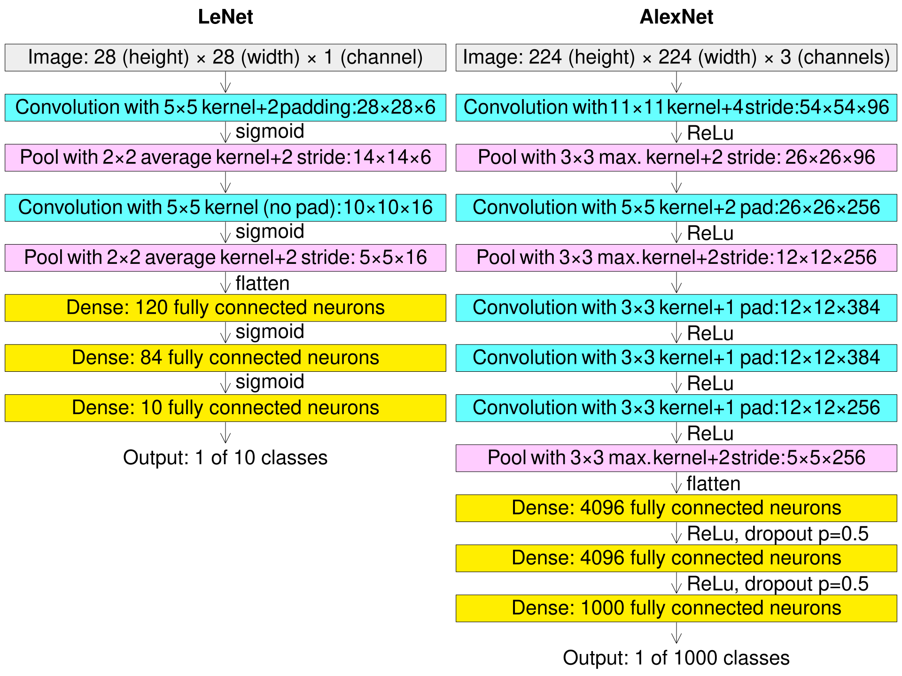

# PyTorch-CNN
Consider AlexNet model given below:

Your task is to:
- Implement the AlexNet model in PyTorch.
- Train the model on the CIFAR-10 dataset.
- Perform all good practices in PyTorch as discussed so far
- Create a requirements.txt file to document the packages you used
- Create a .gitignore file to ignore the data files
- Create a branch for your project on this repository

The best project will be merged into the main branch for showcase! Good luck!

